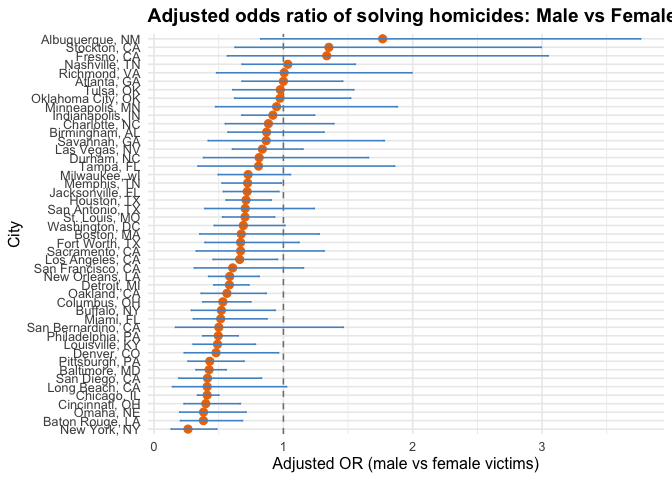
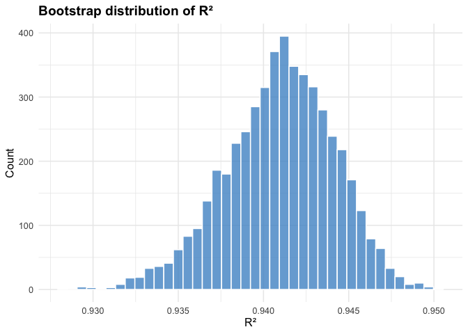
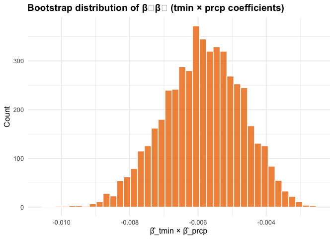

p8105_hw6_at3583
================
Alexandria D.Taylor,
2025-12-03

**This homework explores linear modeling, logistic regression, bootstrap
resampling, and cross-validated prediction using tidy R workflows.**

``` r
knitr::opts_chunk$set(
  echo = TRUE,
  message = FALSE,
  warning = FALSE
)

library(tidyverse)
```

    ## ── Attaching core tidyverse packages ──────────────────────── tidyverse 2.0.0 ──
    ## ✔ dplyr     1.1.4     ✔ readr     2.1.5
    ## ✔ forcats   1.0.0     ✔ stringr   1.5.1
    ## ✔ ggplot2   4.0.0     ✔ tibble    3.3.0
    ## ✔ lubridate 1.9.4     ✔ tidyr     1.3.1
    ## ✔ purrr     1.1.0     
    ## ── Conflicts ────────────────────────────────────────── tidyverse_conflicts() ──
    ## ✖ dplyr::filter() masks stats::filter()
    ## ✖ dplyr::lag()    masks stats::lag()
    ## ℹ Use the conflicted package (<http://conflicted.r-lib.org/>) to force all conflicts to become errors

``` r
library(janitor)
```

    ## 
    ## Attaching package: 'janitor'
    ## 
    ## The following objects are masked from 'package:stats':
    ## 
    ##     chisq.test, fisher.test

``` r
library(broom)
library(purrr)
library(modelr)       
```

    ## 
    ## Attaching package: 'modelr'
    ## 
    ## The following object is masked from 'package:broom':
    ## 
    ##     bootstrap

``` r
library(p8105.datasets) 

# Global colors + theme for plots
primary_color <- "steelblue3"
accent_color  <- "darkorange2"

theme_set(
  theme_minimal(base_size = 12) +
    theme(
      plot.title = element_text(face = "bold"),
      legend.position = "bottom"
    )
)
```

# Problem 1. Homicides and Logistic Regression

``` r
# Load and Clean Homicide data from Washington Post 
homicide_df <- read_csv(
  "https://raw.githubusercontent.com/washingtonpost/data-homicides/master/homicide-data.csv"
) |>
  clean_names()

# Clean + filter for analysis
homicide_city <- homicide_df |>
  mutate(
    city_state = str_c(city, ", ", state),
    # binary outcome: 1 = solved, 0 = not solved
    solved = case_when(
      disposition == "Closed by arrest" ~ 1,
      disposition %in% c("Closed without arrest", "Open/No arrest") ~ 0,
      TRUE ~ NA_real_
    ),
    victim_age = as.numeric(victim_age)
  ) |>
  # drop cities with missing race or bad entry
  filter(
    !(city_state %in% c("Dallas, TX", "Phoenix, AZ", "Kansas City, MO", "Tulsa, AL")),
    victim_race %in% c("White", "Black")
  ) |>
  drop_na(solved, victim_age, victim_sex, victim_race)
```

Summary: The cleaned dataset contains **39403** homicide records
across  
**47** cities. After excluding Dallas, TX; Phoenix, AZ; Kansas City, MO;
and Tulsa, AL, and restricting the analysis to victims who are White or
Black, **39403** cases remain. Victim age is stored as numeric; during
cleaning, **0** records had non-numeric ages and were dropped from
analysis.

## A. Baltimore, MD – logistic regression and adjusted OR

``` r
baltimore_df <- homicide_city |>
  filter(city_state == "Baltimore, MD")

baltimore_fit <- glm(
  solved ~ victim_age + victim_sex + victim_race,
  data = baltimore_df,
  family = binomial()
)

baltimore_or <- baltimore_fit |>
  tidy(exponentiate = TRUE, conf.int = TRUE) |>
  filter(term == "victim_sexMale")

baltimore_or
```

    ## # A tibble: 1 × 7
    ##   term           estimate std.error statistic  p.value conf.low conf.high
    ##   <chr>             <dbl>     <dbl>     <dbl>    <dbl>    <dbl>     <dbl>
    ## 1 victim_sexMale    0.426     0.138     -6.18 6.26e-10    0.324     0.558

Summary: In Baltimore, the adjusted odds ratio for solving a homicide
when a victim is **male** (compared to female victims), controlling for
age and race, is **0.43**, with a 95% confidence interval (CI) of (0.32,
0.56).

## B. Logistic Regression Fitting

``` r
# Nest by city_state and fit logistic regression in each city
city_models <- homicide_city |>
  group_by(city_state) |>
  nest(data = -city_state) |>
  mutate(
    fit = map(
      data,
      ~ glm(
          solved ~ victim_age + victim_sex + victim_race,
          data = .x,
          family = binomial()
        )
    ),
    results = map(
      fit,
      ~ tidy(.x, exponentiate = TRUE, conf.int = TRUE)
    )
  ) |>
  select(city_state, results) |>
  unnest(results) |>
  filter(term == "victim_sexMale") |>
  arrange(estimate)

city_models
```

    ## # A tibble: 47 × 8
    ## # Groups:   city_state [47]
    ##    city_state     term  estimate std.error statistic  p.value conf.low conf.high
    ##    <chr>          <chr>    <dbl>     <dbl>     <dbl>    <dbl>    <dbl>     <dbl>
    ##  1 New York, NY   vict…    0.262     0.328     -4.08 4.54e- 5    0.133     0.485
    ##  2 Baton Rouge, … vict…    0.381     0.306     -3.15 1.65e- 3    0.204     0.684
    ##  3 Omaha, NE      vict…    0.382     0.323     -2.97 2.95e- 3    0.199     0.711
    ##  4 Cincinnati, OH vict…    0.400     0.269     -3.41 6.49e- 4    0.231     0.667
    ##  5 Chicago, IL    vict…    0.410     0.102     -8.77 1.86e-18    0.336     0.501
    ##  6 Long Beach, CA vict…    0.410     0.495     -1.80 7.18e- 2    0.143     1.02 
    ##  7 San Diego, CA  vict…    0.413     0.371     -2.38 1.72e- 2    0.191     0.830
    ##  8 Baltimore, MD  vict…    0.426     0.138     -6.18 6.26e-10    0.324     0.558
    ##  9 Pittsburgh, PA vict…    0.431     0.248     -3.40 6.72e- 4    0.263     0.696
    ## 10 Denver, CO     vict…    0.479     0.360     -2.04 4.11e- 2    0.233     0.962
    ## # ℹ 37 more rows

``` r
# For Summary 
or_summary <- city_models |>
  summarise(
    min_or   = min(estimate),
    max_or   = max(estimate),
    n_gt1    = sum(conf.low > 1),
    n_lt1    = sum(conf.high < 1),
    n_cross1 = sum(conf.low <= 1 & conf.high >= 1)
  )
```

Summary: Across all cities, the adjusted odds ratios for solving
homicides involving male victims range from **1.77, 1, 0.43, 0.38, 0.87,
0.67, 0.52, 0.88, 0.41, 0.4, 0.53, 0.48, 0.58, 0.81, 0.67, 1.34, 0.71,
0.92, 0.72, 0.84, 0.41, 0.66, 0.49, 0.72, 0.52, 0.73, 0.95, 1.03, 0.58,
0.26, 0.56, 0.97, 0.38, 0.5, 0.43, 1.01, 0.67, 0.7, 0.5, 0.41, 0.61,
0.87, 0.7, 1.35, 0.81, 0.98, 0.69** to **1.77, 1, 0.43, 0.38, 0.87,
0.67, 0.52, 0.88, 0.41, 0.4, 0.53, 0.48, 0.58, 0.81, 0.67, 1.34, 0.71,
0.92, 0.72, 0.84, 0.41, 0.66, 0.49, 0.72, 0.52, 0.73, 0.95, 1.03, 0.58,
0.26, 0.56, 0.97, 0.38, 0.5, 0.43, 1.01, 0.67, 0.7, 0.5, 0.41, 0.61,
0.87, 0.7, 1.35, 0.81, 0.98, 0.69**. In **0, 0, 0, 0, 0, 0, 0, 0, 0, 0,
0, 0, 0, 0, 0, 0, 0, 0, 0, 0, 0, 0, 0, 0, 0, 0, 0, 0, 0, 0, 0, 0, 0, 0,
0, 0, 0, 0, 0, 0, 0, 0, 0, 0, 0, 0, 0** cities, the 95% CI lies entirely
above 1, indicating higher odds of case resolution for male victims; in
**0, 0, 1, 1, 0, 0, 1, 0, 1, 1, 1, 1, 1, 0, 0, 0, 1, 0, 1, 0, 0, 1, 1,
1, 1, 0, 0, 0, 1, 1, 1, 0, 1, 1, 1, 0, 0, 0, 0, 1, 0, 0, 1, 0, 0, 0, 0**
cities, the interval lies entirely below 1; and in **1, 1, 0, 0, 1, 1,
0, 1, 0, 0, 0, 0, 0, 1, 1, 1, 0, 1, 0, 1, 1, 0, 0, 0, 0, 1, 1, 1, 0, 0,
0, 1, 0, 0, 0, 1, 1, 1, 1, 0, 1, 1, 0, 1, 1, 1, 1** cities, the CI
includes 1, suggesting no clear difference by victim sex.

## C. Plot ORs and CIs by City

``` r
city_models |>
  ggplot(aes(
    x = reorder(city_state, estimate),
    y = estimate
  )) +
  geom_hline(yintercept = 1, linetype = "dashed", color = "grey50") +
  geom_point(color = accent_color, size = 2.5) +
  geom_errorbar(
    aes(ymin = conf.low, ymax = conf.high),
    width = 0.2,
    color = primary_color
  ) +
  coord_flip() +
  labs(
    title = "Adjusted odds ratio of solving homicides: Male vs Female victims",
    x = "City",
    y = "Adjusted OR (male vs female victims)"
  )
```

<!-- -->

Summary: Most cities have adjusted odds ratios close to 1, suggesting
similar odds of solving homicides for male and female victims after
controlling for age and race. A few cities show odds ratios clearly
above 1, with CIs entirely above the null, indicating higher resolution
rates for male victims. Other display wide intervals that cross 1,
reflecting limited sample sizes and greater data uncertainty in
sex-specific differences.

# Problem 2 – Bootstrap for $R^2$ and $\hat{\beta}_1$, $\hat{\beta}_2$

``` r
# Load and clean Central Park data

data("weather_df")
weather_lm_df <- weather_df |>
  drop_na(tmax, tmin, prcp)
```

## Bootstrap and Model Fitting

``` r
set.seed(8105)

# 5000 bootstrap samples
boot_samples <- weather_lm_df |>
  modelr::bootstrap(n = 5000, id = "boot_id")

# Generate results
boot_results <- boot_samples |>
  mutate(
    model   = map(strap, ~ lm(tmax ~ tmin + prcp, data = .x)),
    glanced = map(model, glance),
    tidied  = map(model, tidy)
  ) |>
  transmute(
    boot_id,
    r_sq = map_dbl(glanced, "r.squared"),
    beta_prod = map_dbl(
      tidied,
      ~ .x |>
        filter(term %in% c("tmin", "prcp")) |>
        summarize(prod = prod(estimate)) |>
        pull(prod)
    )
  )

head(boot_results)
```

    ## # A tibble: 6 × 3
    ##   boot_id  r_sq beta_prod
    ##   <chr>   <dbl>     <dbl>
    ## 1 0001    0.939  -0.00561
    ## 2 0002    0.943  -0.00696
    ## 3 0003    0.944  -0.00453
    ## 4 0004    0.939  -0.00512
    ## 5 0005    0.939  -0.00673
    ## 6 0006    0.943  -0.00770

## 95% bootstrap CIs

``` r
# 95% CI for R^2
r2_ci <- boot_results |>
  summarise(
    lower = quantile(r_sq, 0.025),
    upper = quantile(r_sq, 0.975),
    median = median(r_sq)
  )

# 95% CI for beta1 * beta2
beta_ci <- boot_results |>
  summarise(
    lower = quantile(beta_prod, 0.025),
    upper = quantile(beta_prod, 0.975),
    median = median(beta_prod)
  )

r2_ci
```

    ## # A tibble: 1 × 3
    ##   lower upper median
    ##   <dbl> <dbl>  <dbl>
    ## 1 0.934 0.947  0.941

``` r
beta_ci
```

    ## # A tibble: 1 × 3
    ##      lower    upper   median
    ##      <dbl>    <dbl>    <dbl>
    ## 1 -0.00822 -0.00373 -0.00583

Summary: The bootstrap distribution of R² has a median of **0.941**,
with a 95% interval from **0.934** to **0.947**. For the coefficient
product $\hat{\beta}_{tmin}\hat{\beta}_{prcp}$, the median is
**-0.00583**, with a 95% interval of **(-0.00822**, **-0.00373)**.

## Distribution Plots

``` r
# Distribution plot of R^2
boot_results |>
  ggplot(aes(x = r_sq)) +
  geom_histogram(
    bins = 40,
    fill = primary_color,
    color = "white",
    alpha = 0.8
  ) +
  labs(
    title = "Bootstrap distribution of R²",
    x = "R²",
    y = "Count"
  )
```

<!-- -->

``` r
# Distribution plot of beta_tmin * beta_prcp
boot_results |>
  ggplot(aes(x = beta_prod)) +
  geom_histogram(
    bins = 40,
    fill = accent_color,
    color = "white",
    alpha = 0.8
  ) +
  labs(
    title = "Bootstrap distribution of β₁β₂ (tmin × prcp coefficients)",
    x = "β̂_tmin × β̂_prcp",
    y = "Count"
  )
```

<!-- -->

Summary:Across the 5000 bootstrap samples, the R² values are tightly
concentrated, with a median of 0.941 and a 95% interval from 0.934 to
0.947. This suggests that the linear model with *tmin* and *prcp*
consistently explains a moderate proportion of the variability in *tmax*
across resampled datasets.

The bootstrap distribution of the product
$\hat{\beta}_{tmin}\hat{\beta}_{prcp}$ is centered around -0.00583, with
a 95% interval of (-0.00822, -0.00373). The spread and sign of this
distribution reflect both the magnitudes and directions of the *tmin*
and *prcp* coefficients, illustrating the uncertainty in their combined
contribution to predicting *tmax*.
